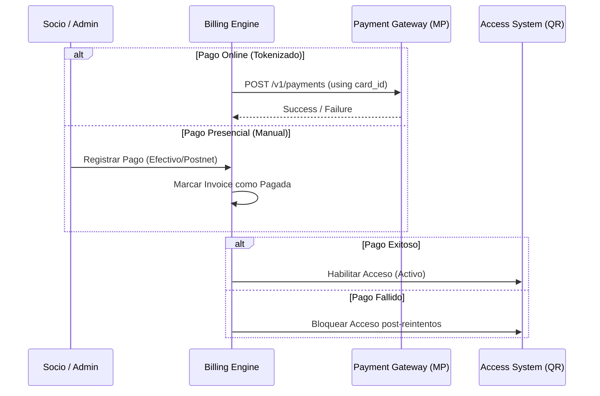
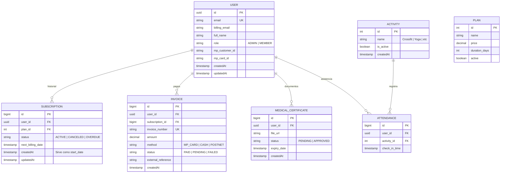

# Elite Fitness SaaS - Product Requirements Document (Argentina)

## 1. Resumen Ejecutivo
- **Objetivo**: Proveer una plataforma integral de administración para gimnasios de élite en Argentina, automatizando el ciclo de vida del socio desde la landing page hasta el acceso físico y la cobranza recurrente.
- **Stakeholders**: Administradores de gimnasios, Socios (Usuarios finales), Entrenadores.
- **Timeline**: MVP (4-6 semanas), Fase 2 (A demanda).

## 2. User Persona & Job to be Done
- **Persona (Admin)**: Dueño de gimnasio que busca reducir la tasa de morosidad y automatizar el control de acceso.
- **Persona (Socio)**: Aficionado al fitness que valora la experiencia premium y la facilidad de pago/acceso.
- **Job to be Done**: Garantizar que solo los socios activos y con certificado médico vigente puedan ingresar al establecimiento de forma fluida.

## 3. Functional Requirements

| ID | Feature | Descripción | Prioridad | Dependencias |
|----|---------|-------------|-----------|--------------|
| F1 | Landing Elite | Landing page de alto impacto con navegación por disciplinas (Musculación, Crossfit, etc). | P0 | - |
| F2 | Sistema QR Dinámico | Generación de QR en la App que cambia cada X segundos para evitar capturas de pantalla. | P0 | F5 |
| F3 | Motor de Cobro Recurrente | Billing orchestrator que integra Mercado Pago/Mobbex/Payway. | P0 | - |
| F4 | Gestión de Apto Físico | Upload de certificado o firma de Declaración Jurada (CABA) con bloqueo automático si expira. | P0 | - |
| F5 | Dashboard de Control | Panel estadístico: ingresos, churn rate, picos de asistencia por disciplina. | P1 | F2, F3 |
| F6 | Perfil del Socio | Historial de entrenamiento, gestión de pagos y descarga de facturas (AFIP ready). | P1 | F3 |

## 4. Technical Architecture

### 4.1 Stack Tecnológico
**Frontend**: Next.js 15+ (App Router), TypeScript, CSS Modules, TanStack Query, Zustand (Global UI State).
**Backend**: NestJS (Arquitectura Modular), TypeScript, TypeORM.
**Database**: PostgreSQL (RDBMS).
**Pagos**: Mobbex (Recomendado por flexibilidad en suscripciones locales), API Mercado Pago (Alternativa).
**Infraestructura**: Dockerized, CI/CD con GitHub Actions.

### 4.2 Estrategia de Pagos (Mercado Pago Tokenizado + Presencial)
Dadas las comisiones de Mercado Pago por suscripciones nativas, se implementará un flujo de **Cobro Recurrente Propio** utilizando tokenización:

1. **Tokenización**: Se guarda el `mp_customer_id` y `mp_card_id` (tokenizado) en nuestra base de datos.
2. **Email de Facturación**: Se permite un email de cobranza distinto al email de la cuenta del socio.
3. **Pagos Presenciales**: Los administradores pueden registrar pagos manuales (Efectivo/Postnet) desde el dashboard, lo que genera una `INVOICE` marcada como `MANUAL` y activa la suscripción sin pasar por la pasarela online.
4. **Motor de Cobro**: Un proceso en segundo plano (Cron Job) ejecutará los cobros en las fechas correspondientes llamando a la API de Pagos de MP con el card token.

### 4.3 Flujo del Motor de Pagos & Acceso

### 4.4 Esquema de Base de Datos (Refinado V2)
Se aplica una estrategia híbrida de IDs: **UUID** para entidades con exposición pública y **BigInt Auto-increment** para tablas internas de alto volumen. Se normaliza la tabla de actividades y se simplifican las fechas redundantes.

### 4.5 Gestión de Archivos (Storage)
Dado que los certificados médicos son datos sensibles y requieren persistencia, se integrará un servicio de **Cloud Storage**:
- **Opción A (Recomendada)**: **Supabase Storage** o **Vercel Blob** por facilidad de integración con Next.js/pnpm.
- **Opción B**: **Cloudinary** si se requiere procesamiento de imágenes/PDFs.
- **Seguridad**: Los archivos deben ser servidos vía **Signed URLs** para que solo el admin y el propio usuario puedan verlos.

### 4.6 Manejo de Invoices (Facturación)
Cada vez que el `BillingEngine` recibe un webhook de éxito:
1. Se crea un registro en `INVOICE`.
2. Se genera un número de factura correlativo.
3. Se vincula el ID de transacción de la pasarela (Mobbex/MP).
4. (Fase 2) Integración con Web Services de AFIP para validación de factura electrónica.

## 5. Cumplimiento Local (Apto Físico)
- **CABA**: El sistema debe presentar un workflow de "Declaración Jurada" digital si el usuario no carga su apto médico físico, siguiendo la Ley 6316.
- **Validación Médica**: Los administradores pueden auditar y aprobar/rechazar documentos cargados.

## 6. RoadMap (MVP & Fases)
- **MVP**: Landing, Registro, Suscripción Mobbex/MP, Generación de QR y Dashboard Básico.
- **Fase 2**: 
    - Gamificación: Rankings de asistencia y medallas.
    - Reserva de cupos para clases (Funcional, Yoga).
    - Tienda de conveniencia integrada.
- **Fase 3**: Integración con hardware de molinetes físicos vía WebSockets.
