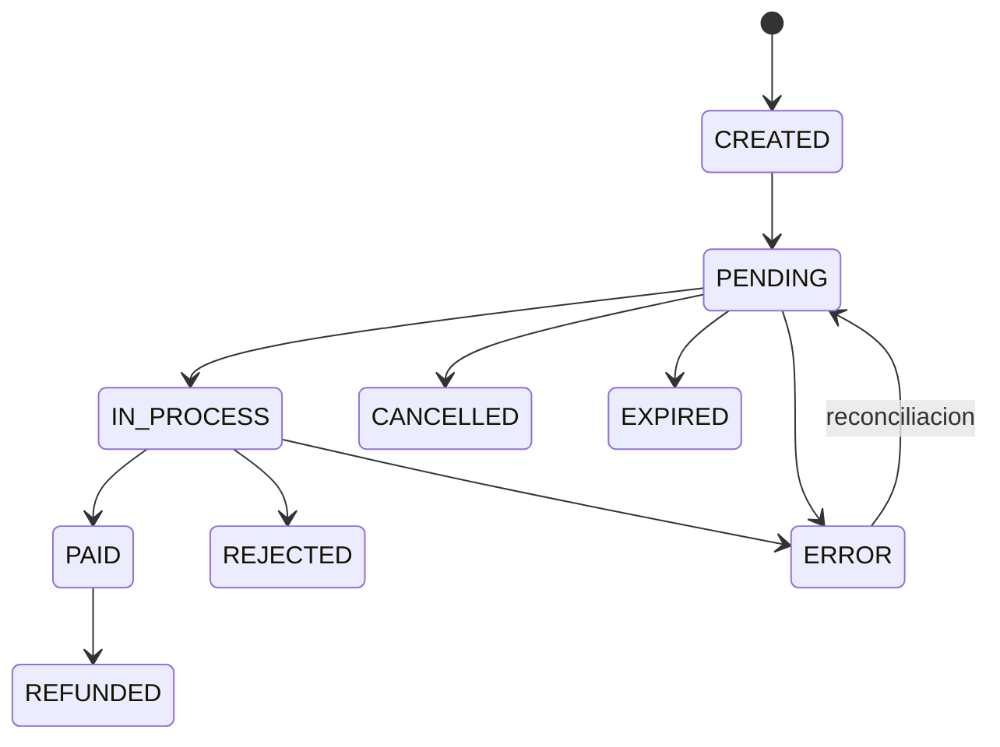

# Integracion de Pagos Presenciales (Mostrador) - Diseno Exhaustivo

Fecha: 2026-02-19  
Proyecto: `gym-admin-system`  
Estado: Documento de arquitectura e implementacion (no implementa fase automatica aun)

## 1. Objetivo

Disenar e implementar un flujo mixto para pagos en mostrador:

1. `Efectivo` y `Transferencia`: carga manual por admin (como hoy).
2. `Postnet` (Point) y `QR`: flujo automatico integrado, donde:
   1. El sistema crea la orden de cobro.
   2. Mercado Pago procesa el pago en terminal/QR.
   3. El sistema recibe confirmacion (webhook + consulta API).
   4. Se crea factura interna en `PAID`.
   5. Se habilita automaticamente el acceso del usuario.

## 2. Alcance y no alcance

### Alcance

1. Cobro presencial de periodos unicos (mensual, trimestral, anual).
2. Integracion automatica para `POSTNET` y `QR`.
3. Persistencia auditable de ordenes, estados y eventos.
4. Conciliacion y recuperacion ante fallos de red/webhook.
5. Actualizacion automatica de estado del alumno y acceso.

### No alcance (esta etapa)

1. Emision de factura fiscal AFIP/ARCA (la factura actual es interna de negocio).
2. Suscripciones recurrentes presenciales con renovacion automatica por terminal.
3. Reemplazar checkout online ya existente (`MP_CARD` web).

## 3. Estado actual (base del proyecto)

1. Ya existe carga manual de pago unico en admin:
   1. Seleccion de alumno existente.
   2. Seleccion de periodo (`MONTHLY/QUARTERLY/YEARLY`).
   3. Seleccion de medio (`CASH`, `POSTNET`, `QR`, `BANK_TRANSFER`).
   4. Creacion de `Invoice` en `PAID`.
2. `AccessService` valida periodo pago segun monto/plan y da acceso.
3. Para flujo manual, el pago lo confirma el operador humano.

## 4. Regla funcional por medio de pago

| Medio | Modo | Fuente de verdad de aprobacion |
|---|---|---|
| `CASH` | Manual | Admin |
| `BANK_TRANSFER` | Manual | Admin (con comprobante) |
| `POSTNET` | Automatico | Mercado Pago (orden + webhook + consulta API) |
| `QR` | Automatico | Mercado Pago (orden + webhook + consulta API) |

## 5. Flujo funcional end-to-end por caso

## 5.1 Efectivo / Transferencia (manual, mantener)

1. Admin busca alumno.
2. Selecciona periodo y medio.
3. Sistema valida reglas:
   1. Alumno existe y es `USER`.
   2. No tiene suscripcion activa.
   3. No tiene periodo pago vigente.
4. Se registra `Invoice` `PAID`.
5. Usuario queda `ACTIVE`.
6. Se refleja acceso por QR/check-in automaticamente.

## 5.2 Postnet (Point) automatico

1. Admin inicia cobro desde dashboard.
2. Sistema crea una `payment order` local en `PENDING`.
3. Sistema crea Order en Mercado Pago (`/v1/orders`) con idempotencia.
4. La orden se envia a terminal Point asociada (sede + caja + terminal).
5. Alumno paga con tarjeta en terminal.
6. Mercado Pago dispara webhook de `order/payment`.
7. Backend valida evento, consulta orden en API de MP y confirma estado final.
8. Si aprobado:
   1. Marca `payment order` local `PAID`.
   2. Crea `Invoice` interna `PAID`.
   3. Marca usuario `ACTIVE`.
9. Si rechazado/cancelado/expirado:
   1. Marca `payment order` local en estado final correspondiente.
   2. No crea `Invoice` `PAID`.
10. Frontend admin se actualiza por polling corto o SSE/WebSocket.

## 5.3 QR automatico (recomendado modelo estatico/hibrido por caja)

1. Cada sede/caja tiene QR fijo asociado en MP (o hibrido con dinamico visual).
2. Admin inicia cobro desde dashboard para alumno + periodo.
3. Sistema crea `payment order` local `PENDING`.
4. Sistema crea Order MP vinculada a esa caja/QR.
5. Alumno escanea QR y paga desde app.
6. MP envia webhook.
7. Backend confirma orden via API MP.
8. Si `PAID`:
   1. `payment order` -> `PAID`.
   2. `Invoice` interna -> `PAID`.
   3. Usuario -> `ACTIVE`.

Nota operativa: si una caja procesa muchos pagos concurrentes, priorizar `hibrido` o `dinamico` para reducir colisiones visuales.

## 6. Implementacion fisica en gimnasio

## 6.1 Sedes, cajas y terminales

1. Definir `sede` y `caja` operativa.
2. Para Point:
   1. Terminal en modo integrado PDV.
   2. Asociada a tienda/sucursal/caja en MP.
3. Para QR:
   1. QR fijo impreso por caja (o hibrido mostrado en pantalla).
   2. Identificador de caja visible para operador.

## 6.2 Protocolo operativo de caja

1. Operador identifica alumno en sistema.
2. Selecciona periodo.
3. Selecciona canal:
   1. Manual (`CASH`/`BANK_TRANSFER`) o
   2. Automatico (`POSTNET`/`QR`).
4. Espera confirmacion en pantalla antes de entregar comprobante final.
5. Si no llega confirmacion, usa boton `Reconsultar` (no recargar pago manualmente).

## 7. Arquitectura tecnica objetivo

## 7.1 Componentes

1. `AdminDashboard`:
   1. Crear orden presencial.
   2. Mostrar estado en tiempo real.
2. `CounterPaymentsService` (nuevo servicio backend):
   1. Validaciones de elegibilidad.
   2. Creacion de orden local.
   3. Integracion MP Orders API.
   4. Finalizacion de negocio al aprobar.
3. `MercadoPagoWebhookController`:
   1. Recepcion de notificaciones.
   2. Validacion, deduplicacion, encolado/procesamiento.
4. `ReconciliationWorker`:
   1. Reconsulta ordenes en `PENDING` o `IN_PROCESS`.
5. `Billing/Access`:
   1. Creacion `Invoice`.
   2. Habilitacion de usuario.

## 7.2 Modelo de estados (propuesto)

Estados de `counter_payment_orders`:

1. `CREATED`
2. `PENDING`
3. `IN_PROCESS`
4. `PAID` (final feliz)
5. `REJECTED` (final)
6. `CANCELLED` (final)
7. `EXPIRED` (final)
8. `REFUNDED` (final)
9. `ERROR` (requiere atencion/reconciliacion)

Mermaid:



## 8. Modelo de datos (propuesta concreta)

## 8.1 Tabla `counter_payment_orders`

Campos recomendados:

1. `id` (bigint)
2. `uuid` (uuid, publico)
3. `user_id` (FK users)
4. `plan_id` (`MONTHLY|QUARTERLY|YEARLY`)
5. `channel` (`MANUAL_CASH|MANUAL_TRANSFER|POINT|QR`)
6. `payment_method` (`CASH|BANK_TRANSFER|POSTNET|QR`)
7. `status` (state machine)
8. `amount` (numeric)
9. `currency` (`ARS`)
10. `branch_id` (FK gym_branches)
11. `cash_register_code` (string)
12. `terminal_id` (string, para Point)
13. `mp_order_id` (string, unique nullable)
14. `mp_payment_id` (string nullable)
15. `external_reference` (string unique)
16. `idempotency_key` (string unique)
17. `invoice_id` (FK invoices nullable)
18. `requested_by_admin_user_id` (FK users)
19. `created_at`, `updated_at`, `expires_at`, `paid_at`
20. `failure_reason` (string nullable)
21. `raw_last_snapshot` (jsonb nullable)

## 8.2 Tabla `payment_webhook_events`

1. `id`
2. `provider` (`mercadopago`)
3. `event_type`
4. `event_id` (unique por proveedor si aplica)
5. `resource_id` (`order_id`/`payment_id`)
6. `received_at`
7. `processed_at`
8. `status` (`RECEIVED|PROCESSED|IGNORED|FAILED`)
9. `payload` (jsonb)
10. `error_message`

Objetivo: idempotencia, auditoria, replay seguro.

## 9. Contratos API (propuestos)

## 9.1 Iniciar cobro automatico

`POST /api/admin/payments/counter/orders`

Body:

```json
{
  "userUuid": "uuid-user",
  "planId": "MONTHLY",
  "channel": "POINT",
  "branchCode": "main",
  "cashRegisterCode": "caja-1",
  "terminalId": "PAX-123"
}
```

Response:

```json
{
  "orderUuid": "uuid-order-local",
  "status": "PENDING",
  "channel": "POINT",
  "amount": 15000,
  "currency": "ARS",
  "mpOrderId": "123456789",
  "expiresAt": "2026-02-19T22:10:00.000Z"
}
```

## 9.2 Estado de cobro

`GET /api/admin/payments/counter/orders/:uuid`

Response:

```json
{
  "orderUuid": "uuid-order-local",
  "status": "PAID",
  "invoiceUuid": "uuid-invoice",
  "paidAt": "2026-02-19T22:03:01.000Z"
}
```

## 9.3 Cancelar cobro pendiente

`POST /api/admin/payments/counter/orders/:uuid/cancel`

## 9.4 Webhook MP

`POST /api/payments/webhooks/mercadopago`

1. Acknowledge rapido (`200/201`).
2. Procesar asincrono o dentro de transaccion corta.
3. Siempre reconsultar estado final por API MP antes de mutar negocio.

## 10. Flujo tecnico detallado (codigo)

## 10.1 Creacion de orden (POSTNET/QR)

1. Validar input + permisos admin.
2. Resolver usuario + plan + monto.
3. Validar elegibilidad:
   1. Sin suscripcion activa.
   2. Sin periodo pago vigente.
4. Crear `counter_payment_order` local con `external_reference` + `idempotency_key`.
5. Llamar `POST /v1/orders` en MP.
6. Guardar `mp_order_id`.
7. Retornar estado al frontend.

## 10.2 Confirmacion por webhook

1. Guardar evento bruto en `payment_webhook_events`.
2. Deduplicar por `event_id/resource/action`.
3. Consultar orden real en MP:
   1. Si no esta pagada, actualizar estado intermedio y terminar.
   2. Si esta pagada, continuar.
4. Iniciar transaccion DB:
   1. Lock `counter_payment_order` por `mp_order_id` o `external_reference`.
   2. Si ya esta finalizada, salir idempotente.
   3. Crear `Invoice` `PAID` (si no existe).
   4. Linkear `invoice_id`.
   5. Setear `user.status = ACTIVE`.
   6. Marcar order `PAID`.
5. Commit.

## 10.3 Reconciliacion

Cron cada 1-5 min:

1. Buscar orders `PENDING/IN_PROCESS` vencidas o antiguas.
2. Reconsultar MP.
3. Cerrar en estado final.
4. Alertar si persiste inconsistencia.

## 11. Idempotencia y consistencia

Reglas obligatorias:

1. `X-Idempotency-Key` unico al crear order en MP.
2. `external_reference` unico por `counter_payment_order`.
3. Constraint unico para evitar 2 invoices para la misma orden.
4. Webhook handler idempotente.
5. Operaciones de negocio en transaccion.

## 12. Seguridad

1. Endpoint admin protegido por JWT + role ADMIN.
2. Webhook:
   1. Validar firma cuando disponible.
   2. Si canal no permite firma robusta, no confiar ciegamente en payload.
   3. Confirmar siempre contra API MP.
3. No exponer access tokens en frontend.
4. Secretos en `.env` y vault en produccion.
5. Audit trail completo de quien genero cobro manual/automatico.

## 13. UX operativa de caja

## 13.1 Postnet

1. Pantalla con estado en tiempo real:
   1. `Enviada a terminal`
   2. `Esperando pago`
   3. `Pagada` o `Rechazada`
2. Botones:
   1. `Reconsultar estado`
   2. `Cancelar`

## 13.2 QR

1. Opcion recomendada: QR estatico por caja + order asociada.
2. Mostrar:
   1. Monto
   2. Alumno
   3. Temporizador de expiracion
3. Si pasa el timeout: `Expirada` + boton `Generar nueva orden`.

## 13.3 Manual (efectivo/transferencia)

1. Mantener flujo actual.
2. Agregar campos operativos:
   1. `reference` (opcional)
   2. `observacion`
   3. `comprobante_url` (transferencia, opcional)

## 14. Observabilidad y alertas

Metricas:

1. `counter_orders_created_total{channel}`
2. `counter_orders_paid_total{channel}`
3. `counter_orders_failed_total{channel,reason}`
4. `webhook_events_received_total{type}`
5. `webhook_processing_latency_ms`
6. `reconciliation_fixes_total`

Alertas:

1. Webhook sin eventos por > X min en horario operativo.
2. Orders `PENDING` > umbral.
3. Diferencia diaria entre ordenes `PAID` y `Invoices PAID`.

## 15. Pruebas recomendadas

## 15.1 Unitarias

1. Elegibilidad de alumno.
2. Idempotencia de finalizacion.
3. Mapeo de estados MP -> estados internos.

## 15.2 Integracion

1. Crear order + persistir referencias.
2. Webhook duplicado no duplica factura.
3. Reconciliacion cierra orden pendiente.

## 15.3 E2E operativa

1. Caja crea orden Point, paga, usuario habilitado.
2. Caja crea orden QR, paga, usuario habilitado.
3. Efectivo manual sigue funcionando.
4. Transferencia manual sigue funcionando.

## 16. Plan de implementacion por fases

## Fase 1 - Base tecnica

1. Crear tablas `counter_payment_orders` y `payment_webhook_events`.
2. Crear servicio `CounterPaymentsService`.
3. Crear endpoints de create/status/cancel.

## Fase 2 - Integracion MP Orders

1. Cliente MP Orders API.
2. Creacion real de order para Point y QR.
3. UI admin de estado por orden.

## Fase 3 - Webhooks + reconciliacion

1. Endpoint webhook MP.
2. Finalizacion automatica (`Invoice` + `ACTIVE`).
3. Cron de reconciliacion.

## Fase 4 - Hardening

1. Observabilidad y alertas.
2. Pruebas de carga de webhook.
3. Playbook operativo de caja.

## 17. Riesgos y mitigaciones

1. Webhook perdido/demorado:
   1. Mitigar con reconciliacion.
2. Pago aprobado pero UI no actualiza:
   1. Polling/SSE + endpoint de estado.
3. Doble cobro por reintento:
   1. Idempotencia estricta.
4. Ambiguedad en QR estatico con alta concurrencia:
   1. Usar hibrido/dinamico en cajas de alto trafico.

## 18. Decision recomendada para este proyecto

1. Mantener `CASH` y `BANK_TRANSFER` manuales (sin cambios).
2. Implementar automatizacion primero para `POSTNET` (Point).
3. Luego activar `QR` con modelo estatico por caja y migrar a hibrido donde haya concurrencia.
4. No crear `Invoice` `PENDING` en mostrador automatico:
   1. Crear `Invoice` solo al confirmar `PAID`.
   2. Usar `counter_payment_orders` para estados intermedios.

## 19. Referencias oficiales usadas (Mercado Pago)

1. Webhooks (notificaciones, firma, reintentos, ACK y consulta posterior):  
https://www.mercadopago.com.ar/developers/en/docs/your-integrations/notifications/webhooks

2. Point + Orders API (novedad oficial, una API para cobros presenciales):  
https://www.mercadopago.com.ar/developers/en/news/2025/07/16/Transform-your-point-of-sale-with-the-new-integration-between-Point-and-the-Orders-API

3. Point payment processing (flujo integrado POS con orders):  
https://www.mercadopago.com.ar/developers/en/docs/mp-point/payment-processing

4. Orders API reference (crear order, idempotency key):  
https://www.mercadopago.com.ar/developers/es/reference/orders/online-payments/create/post

5. Orders API in-person / Point reference:  
https://www.mercadopago.com.ar/developers/es/reference/in-person-payments/point/orders/create-order/post

6. QR payment processing (modelos estatico/dinamico/hibrido):  
https://www.mercadopago.com.ar/developers/es/docs/qr-code/payment-processing

7. Novedad oficial QR + Orders API (2025):  
https://www.mercadopago.com.ar/developers/es/news/2025/09/24/QR-Code-Integration-with-Orders-API

## 20. Nota importante de validacion

Algunos comportamientos de notificaciones y firma cambian por producto/pais/version de doc.  
Antes de codificar en produccion, validar en tu cuenta de developer:

1. Topics exactos habilitados para Point y QR.
2. Disponibilidad de firma para el tipo de evento que vas a usar.
3. Campos finales de payload en tu app y pais.
4. Comportamiento en credenciales de prueba vs produccion.
