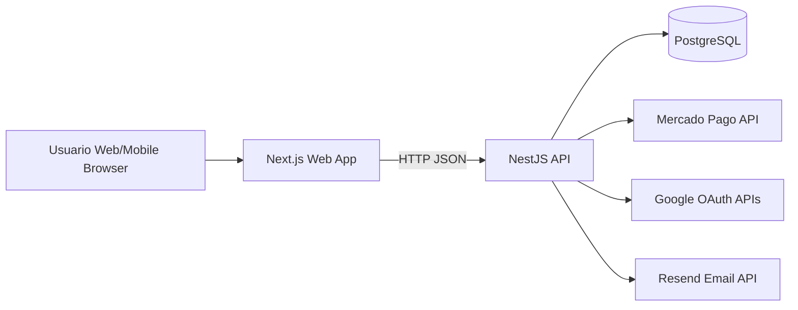

# 02 - Arquitectura General del Sistema

## Vista de alto nivel
El sistema se implementa como monorepo con frontend separado de backend y contrato compartido de tipos.

## Estilo arquitectonico
- Monolito modular en backend (NestJS por modulos de dominio)
- Frontend SPA/SSR hibrido con App Router (Next.js)
- Persistencia relacional con TypeORM
- Integraciones externas encapsuladas en servicios de dominio

## Monorepo
- `apps/web`: UI y experiencia usuario/admin
- `apps/api`: logica de negocio y persistencia
- `packages/shared`: enums/interfaces comunes

## Principios aplicados
- Separacion de responsabilidades por modulo
- Contratos tipados compartidos para minimizar drift FE/BE
- Validacion de entrada en DTOs (class-validator)
- Reglas de negocio centralizadas en servicios
- CI obligatorio antes de merge

## Integraciones externas
- Mercado Pago: pagos checkout y operaciones de tarjeta
- Google OAuth: autenticacion federada
- Resend: envio de email (verificacion y recuperacion)

## Consideraciones no funcionales
- CORS habilitado para desarrollo
- JWT stateless para autenticacion
- Soporte de roles (`ADMIN`/`USER`)
- Logs de API y manejo de errores HTTP
