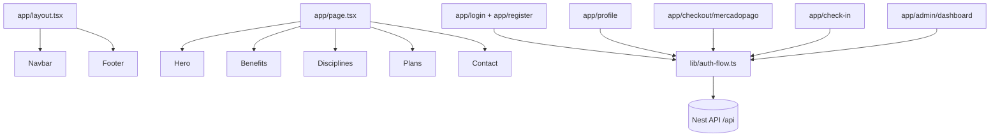
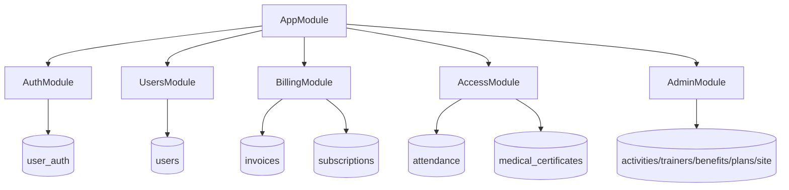

# 05 - Esquema de Componentes

## 1. Componentes frontend (macro)

## 2. Componentes backend (macro)

## 3. Mapa de integraciones
- `AuthService` <-> Google OAuth
- `AuthEmailService` <-> Resend
- `PaymentsService` / `BillingService` <-> Mercado Pago
- `AccessService` <-> QR signed token + reglas de elegibilidad

## 4. Estados relevantes de UI
- Auth: `idle/loading/success/error`
- Checkout: `session-check`, `mode`, `submitting`, `result`
- Check-in: `loading/auth/blocked/ready/submitting/success/error`
- Admin dashboard: `boot loading`, `tab state`, `saving`, `notice/error`
