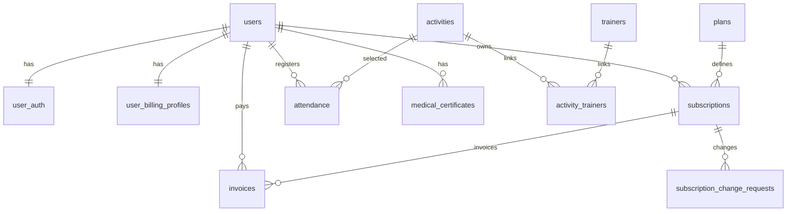

# 10 - Diseno de Base de Datos (PostgreSQL)

## Motor y estrategia
- Motor: PostgreSQL 15
- ORM: TypeORM
- Claves:
  - `id` bigint autoincrement para PK internas
  - `uuid` para identificadores publicos en entidades expuestas

## Diagrama ER simplificado

## Tablas de negocio principales

### `users`
Campos clave:
- `id`, `uuid`
- `first_name`, `last_name`, `email`, `phone`, `avatar_url`
- `status`, `role`
- `createdAt`, `updatedAt`

Restricciones:
- `email` unico
- `uuid` unico

### `user_auth`
Campos clave:
- `user_id` (unique)
- `password` (nullable para Google)
- `email_verified_at`
- `email_verification_token_hash`, `email_verification_token_expires_at`
- `password_reset_token_hash`, `password_reset_token_expires_at`
- `auth_provider`, `google_sub`

### `user_billing_profiles`
Campos clave:
- `user_id` (unique)
- `mp_customer_id`, `mp_card_id`
- `card_brand`, `card_last_four`, `card_issuer`
- `cardholder_name`, `card_expiration_month`, `card_expiration_year`

### `plans`
Campos clave:
- `id` (`MONTHLY|QUARTERLY|YEARLY`)
- `name`, `description`, `price`, `currency`
- `features[]`, `highlight`, `badge`, `is_active`

### `subscriptions`
Campos clave:
- `id`, `uuid`, `user_id`
- `plan_id`, `status`, `auto_renew`, `billing_cycle_anchor_day`
- `startDate`, `endDate`, `createdAt`, `updatedAt`

### `subscription_change_requests`
Campos clave:
- `id`, `uuid`, `user_id`
- `subscription_id` (nullable)
- `new_plan_id`, `new_auto_renew`
- `status`, `effective_at`, `created_at`

### `invoices`
Campos clave:
- `id`, `uuid`
- `user_id`, `subscription_id` (nullable)
- `amount`, `currency`, `status`, `paymentMethod`
- `idempotencyKey` (unique)
- `paidAt`, `createdAt`, `updatedAt`

### `attendance`
Campos clave:
- `id`, `uuid`, `user_id`
- `check_in_at`, `check_out_at`
- `device_id`, `activity_slug`, `gym_location`

### `medical_certificates`
Campos clave:
- `id`, `uuid`, `user_id`
- `doctorName`, `issuedAt`, `validUntil`, `fileUrl`, `createdAt`

### `gym_site_settings`
- configuracion textual/visual del hero y datos institucionales

### `gym_branches`
- `code` unico por sede
- `name`, `address`, `active`

### `trainers`
- nombre, bio, avatar, activo

### `activities`
- slug unico, metadata visual y textos funcionales
- arrays: `benefits`, `schedule`, `successCriteria`
- relacion N:N con `trainers`

### `benefits`
- titulo, descripcion, iconKey, activo

### `admin_content` (legacy)
- bucket JSON por `key` (compatibilidad historica)

## Observaciones de consistencia
- la estructura actual separa correctamente auth y billing del core user.
- `invoice.user_id` se mantiene para consultas directas por usuario (ademas de `subscription_id`).
